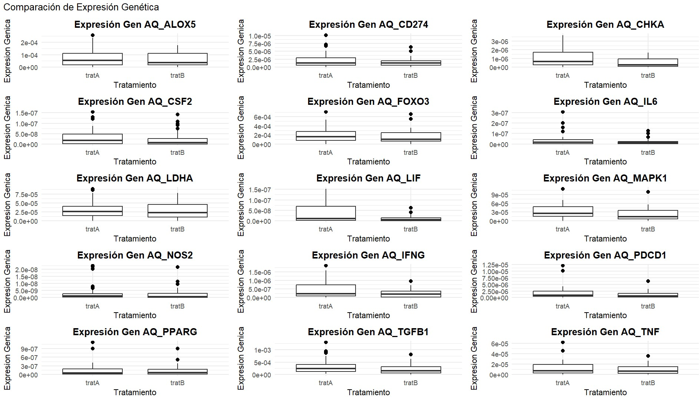
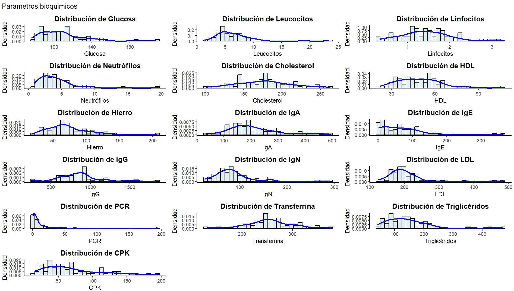

# COMPARACIÓN DE EXPRESIÓN GENÉTICA

El análisis comparativo de la expresión génica entre los tratamientos A y B revela patrones significativos en la regulación transcripcional. Se observa una tendencia general donde el tratamiento A induce niveles de expresión ligeramente superiores en comparación con el tratamiento B, aunque esta diferencia varía según el gen analizado. Los genes muestran diferentes grados de respuesta: mientras algunos como IL6 y AQ_LIF presentan diferencias notables entre tratamientos, otros como AQ_LDHA y FOXO3 mantienen niveles similares de expresión independientemente del tratamiento aplicado. La variabilidad en la expresión se evidencia por la presencia de valores atípicos en varios genes, particularmente en ALOX5, CSF2, IL6 y NOS2, sugiriendo una respuesta heterogénea al tratamiento. Los niveles de expresión varían considerablemente entre genes, desde 1e-07 hasta 1e-03, indicando diferentes grados de activación génica. El tratamiento A parece tener un efecto más pronunciado en genes relacionados con la respuesta inmune e inflamatoria, como lo demuestran los patrones de expresión de IL6, IFNG y TNF. Esta distribución diferencial de la expresión génica sugiere que, aunque ambos tratamientos modulan la transcripción, el tratamiento A genera una respuesta transcripcional más robusta en varios de los genes analizados, lo cual podría tener implicaciones significativas para su eficacia terapéutica.

# PARÁMETROS BIOQUÍMICOS

El análisis bioquímico y molecular muestra patrones que podrían estar relacionados con la presencia de cáncer en todos los pacientes estudiados, aunque se trate de diferentes tipos. Variables como glucosa, pcr y neutrófilos, que presentan distribuciones sesgadas hacia niveles elevados en ciertos individuos, podrían estar vinculadas con inflamación sistémica o metabólica, procesos comunes en pacientes oncológicos. Asimismo, la amplia dispersión en parámetros como igA, igE y triglicéridos podría reflejar las variaciones entre los distintos tipos de cáncer, su progresión o respuestas individuales al tratamiento. Por otro lado, los clusters de expresión génica identificados (como el grupo de pacientes 34, 42 y 55 con patrones de expresión elevados) sugieren que algunos subgrupos moleculares comparten características biológicas, probablemente asociadas a vías específicas activadas en el cáncer. Esto podría vincularse con los valores bioquímicos anómalos observados, como la elevación de igG o alteraciones en cpk, que podrían reflejar daño tisular, actividad tumoral o respuesta inmunitaria. En conjunto, la combinación de estos datos refuerza la hipótesis de que tanto las alteraciones bioquímicas como los patrones génicos están estrechamente relacionados con el tipo y la dinámica del cáncer en cada paciente, aportando pistas sobre posibles biomarcadores o subgrupos terapéuticos